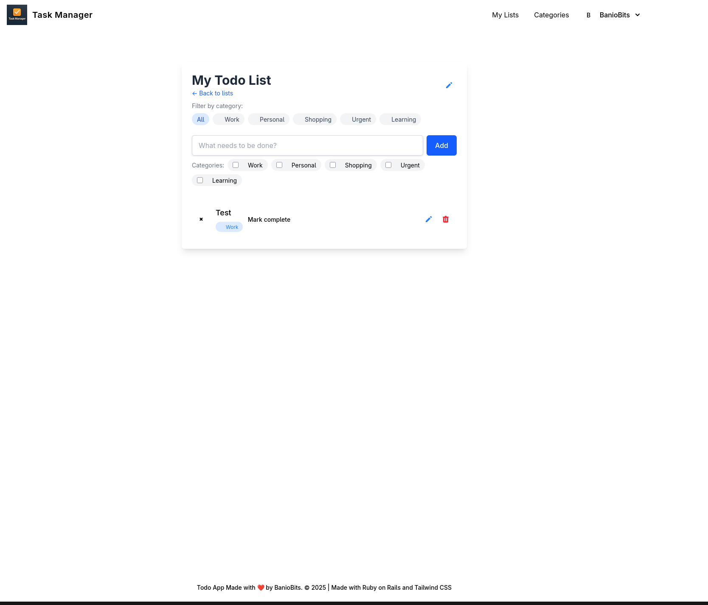

<div align="center">
  
  <h1>Task Manager App</h1>
</div>

A modern and intuitive to-do application built with Ruby on Rails, allowing users to manage their tasks with multiple lists and organize them by categories.



## Features

- User authentication with registration and login
- Multiple todo lists for better organization
- Create, read, update, and delete tasks
- Assign multiple categories to tasks
- Color-coded categories for visual organization
- Filter tasks by category within lists
- Mobile-responsive design using Tailwind CSS

## Technology Stack

- Ruby 3.4.1
- Rails 8.0.1
- SQLite3 database (development)
- PostgreSQL (production)
- Devise for authentication
- Turbo and Stimulus for JavaScript enhancements
- Tailwind CSS for styling

## Installation

### Prerequisites

- Ruby 3.4.1
- Bundler
- Node.js and Yarn
- SQLite3 (development) or PostgreSQL (production)

### Setup for Development

1. Clone the repository

```bash
git clone https://github.com/Est3banio/baniobits-todo-app.git
cd task-manager
```

2. Install dependencies

```bash
bin/setup
```

3. Set up environment variables

```bash
cp .env.example .env
# Edit .env with your configuration
```

4. Start the development server

```bash
bin/dev
```

5. Visit <http://localhost:3000> in your browser

### Running Tests

Run the test suite with:

```bash
bin/rails test
```

## Database Structure

The application has four main models:

- **User**: Manages authentication and owns todo lists
- **TodoList**: A collection of related tasks belonging to a user
- **Todo**: Represents individual tasks belonging to a todo list
- **Category**: Color-coded labels that can be assigned to multiple tasks

## Deployment

### Deploying with Docker

```bash
docker build -t task-manager .
docker run -p 3000:3000 task-manager
```

### Deploying to Heroku

```bash
# Login to Heroku
heroku login

# Create a new Heroku app
heroku create your-app-name

# Push to Heroku
git push heroku main

# Set up the database
heroku run rails db:migrate

# Open the application
heroku open
```

## Contributing

We welcome contributions to the Task Manager App! Please read our [Contributing Guide](CONTRIBUTING.md) to get started.

## License

This project is open source under the [MIT license](LICENSE).

## Screenshots

<div align="center">
  
</div>

## Support

If you have any questions or need help with the Task Manager App, please open an issue on GitHub.

